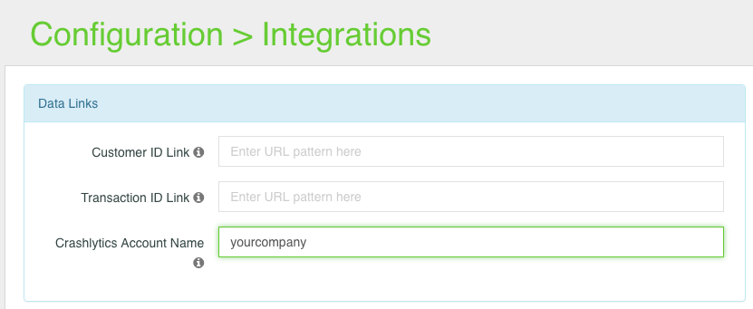
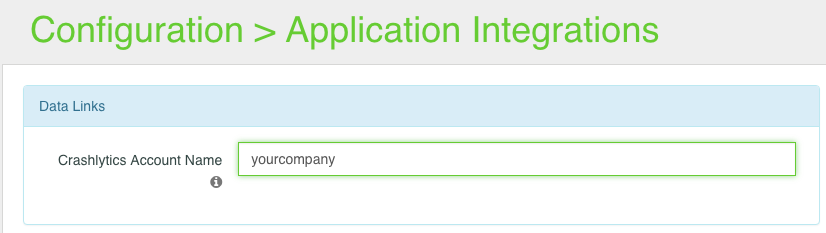

# Crashlytics support (Fabric.io)
## Integrate

According to official [documentation](https://docs.fabric.io/apple/crashlytics/installation.html), integrate Fabric.io & Crashlytics to your project.   
In your `<UIApplicationDelegate>` class import:  

	#import <UserCareSDK/UserCareSDK.h>
	#import <Fabric/Fabric.h>
	#import <Crashlytics/Crashlytics.h>	

Add Facric.io initialization:  
	
	@interface AppDelegate () <CrashlyticsDelegate>

	@end
	...
	- (BOOL)application:(UIApplication *)application didFinishLaunchingWithOptions:(NSDictionary *)launchOptions
	{
		...  
	    CrashlyticsKit.delegate = self;
	    [Fabric with:@[[Crashlytics class]]];
		...
	}
	
Override protocol method for `<CrashlyticsDelegate>`:

	#pragma mark - Crashlytics

	- (void)crashlyticsDidDetectReportForLastExecution:(CLSReport *)report completionHandler:(void (^)(BOOL submit))completionHandler
	{
		[[UCEventLogger sharedInstance] sendCrashlyticsCrashEvent: report];
		completionHandler(YES);
	}
## UserCare setup

Find your company name at url path
  
  
And put into ingration settings:

  

or

