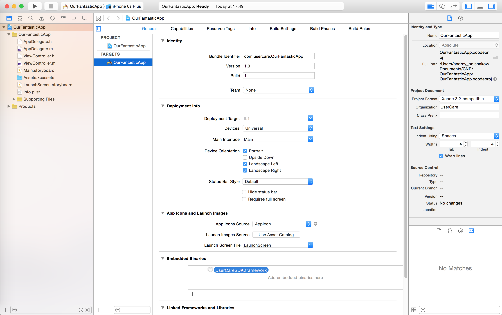
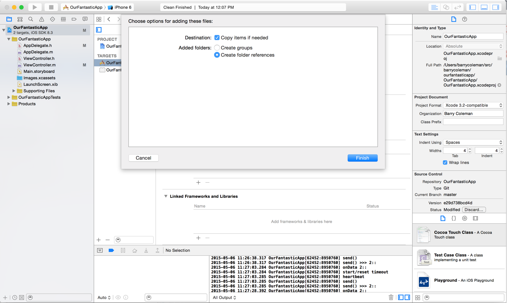
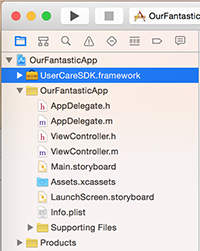
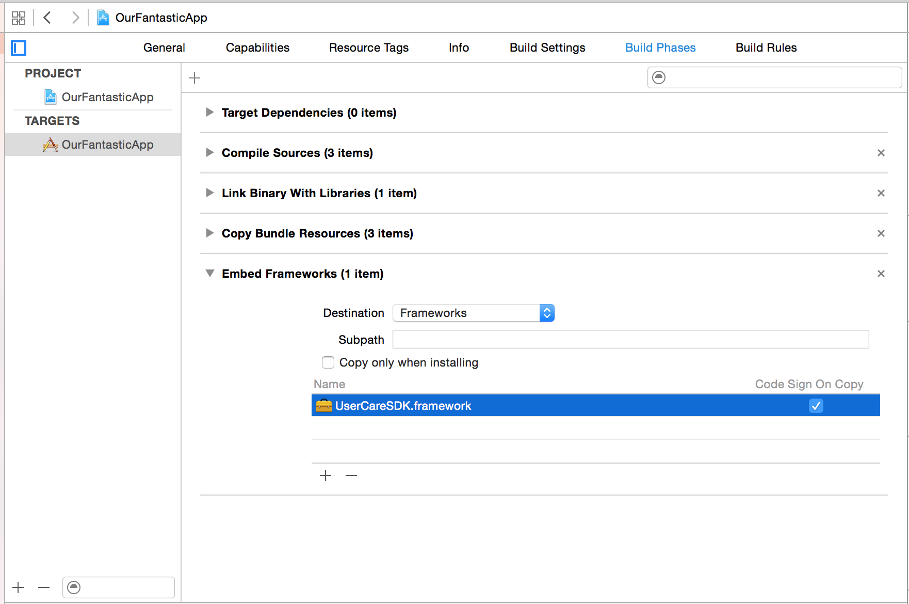

# Integrate UserCare SDK to your project
## Using CocoaPods

If you don't have CocoaPods installed, please refer to [official instructions](https://guides.cocoapods.org/using/getting-started.html).
In case if your project not use CocoaPods yet, please refer to [integration instructions](https://guides.cocoapods.org/using/using-cocoapods.html).

Add to your `Pods` file next dependency:

	pod 'UserCareSDK'
	
And install it to workspace by execution of command:

	pod install
	
For future updates of UserCare SDK use next command:

	pod update UserCareSDK

If you use Swift language in your project, please make sure that your `Pods` file contains next line:

	use_frameworks!
	
Basically final `Pods` file may looks like:

	platform :ios, '8.0'

	use_frameworks!

	target 'UserCareDemo' do
  		pod 'UserCareSDK'
	end

## Manual installation

To get started your should download framework from [github](https://github.com/usercare/ios-sdk) repository.

Open your project detail page to the `General` tab and drag the `UserCareSDK` to the `Embedded Binaries` section:

Check the `Copy items if needed` for `Destination` and click `Finish`:

You should see the `UserCareSDK` appear in the project outline:

You should see the `UserCareSDK` listed under `Embed Frameworks` in the project `Build Phases`:

